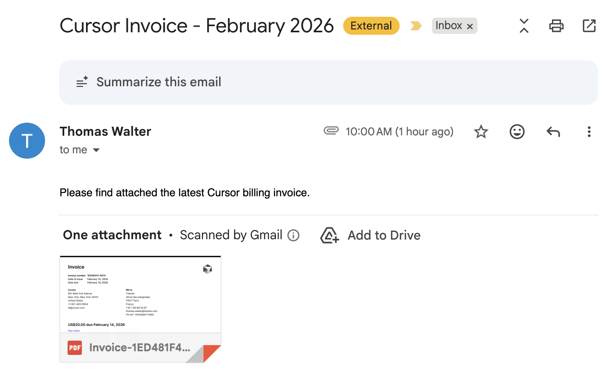

# Cursor Billing Invoice Auto-Downloader & Emailer

Automatically downloads the latest Cursor billing invoice and emails it via Mail.app.

Uses Playwright with a persistent browser session: first run requires manual Google OAuth login in a headed browser, subsequent runs work headless.




## Setup

```bash
npm install
npx playwright install chromium
```

## Usage

### First time: log in manually

```bash
npm run login
```

A Chromium window opens and navigates to the Cursor billing page. Complete Google OAuth login manually. Once authenticated, the session is saved to `.browser-data/` and the latest invoice is downloaded and emailed.

### Subsequent runs (headless)

```bash
npm start
```

Reuses the persisted session — no browser window needed. Downloads the latest invoice to `invoices/` and sends it via Mail.app.

If the session has expired, the script exits with a message to re-run `npm run login`.

### Schedule monthly

```bash
npm run schedule
```

Installs a launchd job that runs on the 3rd of each month at 10:00 AM.

To remove the schedule:

```bash
npm run unschedule
```

## Configuration

| Variable | Default | Description |
|----------|---------|-------------|
| `EMAIL_TO` | `thomas.walter@theodo.com` | Recipient email address |

```bash
EMAIL_TO=someone@example.com npm start
```

## How it works

1. Launches Chromium with a persistent context (cookies/session saved in `.browser-data/`)
2. Navigates to `https://cursor.com/dashboard?tab=billing`
3. Finds invoice links on the page and downloads the latest PDF
4. Falls back to clicking download buttons on Stripe invoice pages, or printing the page as PDF
5. Sends the PDF as an attachment via Mail.app using AppleScript
